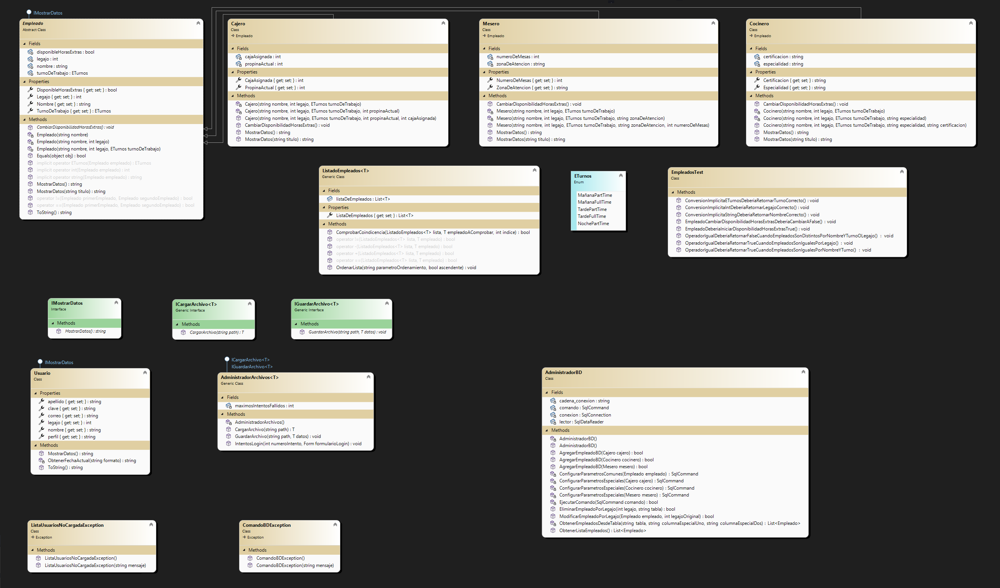

# Aplicación: Organización de empleados - CRUD
## Sobre mi:
Soy un estudiante en la carrera de Tecnicatura Universitaria en Programación de la UTN-FRA que está interesado en dedicarse de manera profesional en el ámbito de la programación y desarrollo de software.

##  Resumen de la aplicación:
Esta aplicación está diseñada para realizar un CRUD sobre un listado de posibles empleados de (en este ejemplo) un restaurante, contando con un login de usuario con contraseña teniendo registro de estos mismos con fecha y hora.

