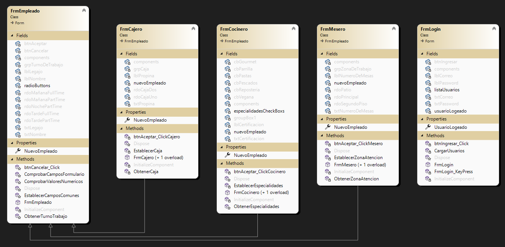
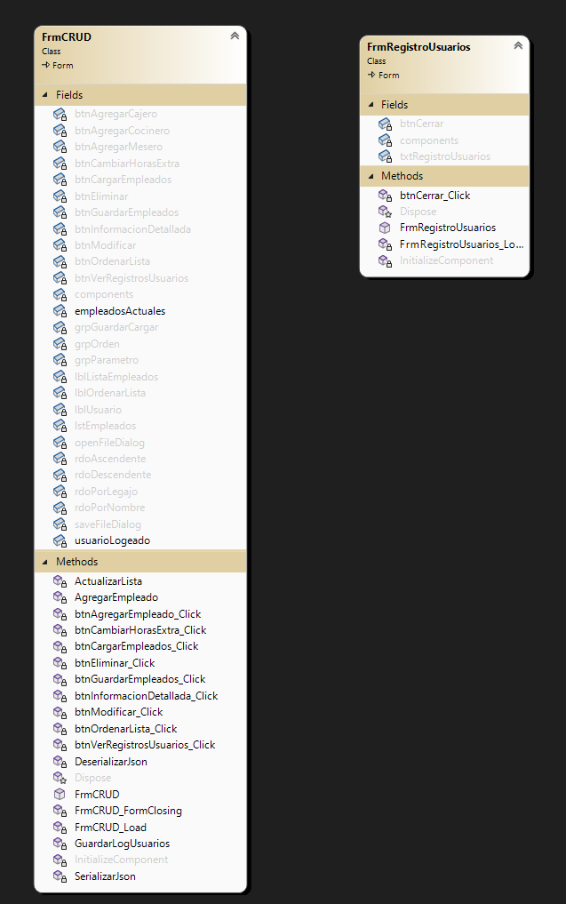

# Aplicación: Organización de empleados - CRUD
## Sobre mi:
Soy un estudiante en la carrera de Tecnicatura Universitaria en Programación de la UTN-FRA que está interesado en dedicarse de manera profesional en el ámbito de la programación y desarrollo de software.

##  Resumen de la aplicación:
Esta aplicación está diseñada para realizar un CRUD sobre un listado de posibles empleados de (en este ejemplo) un restaurante, ordenando y detallando la información de cada elemento a la vez que impide la duplicación de sus miembros.  
La aplicación cuenta con un login de usuario con contraseña, teniendo registro de estos mismos con fecha y hora.   
Puede guardar y cargar la lista de empleados con formato un JSON.

## Diagrama de clases:

## Diagrama de formularios:

